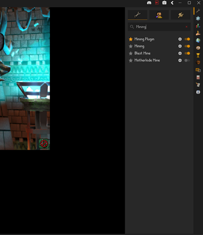

<!-- PROJECT LOGO -->
<br />
<div align="center">
  <a href="https://kraken-plugins.com">
    
  </a>

<h3 align="center">Kraken API</h3>

  <p align="center">
   An extended RuneLite API for creating plugins that support client interactions.
    <br />
</div>

[](https://github.com/cbartram/kraken-api/actions/workflows/release.yml)
[![Contributors][contributors-shield]][contributors-url]
[![Forks][forks-shield]][forks-url]
[![Stargazers][stars-shield]][stars-url]
[![Issues][issues-shield]][issues-url]

---

# 🚀 Getting Started

Kraken API is designed to extend the RuneLite API with additional client-interaction utilities for writing automation based plugins that are compatible with RuneLite. If you are
just looking to use pre-existing plugins, you can skip this repository and head over to our website: [kraken-plugins.com](https://kraken-plugins.com).

For more documentation on the API and Kraken plugins please see our [official documentation here](https://kraken-plugins.com/docs/).

### Prerequisites
- [Java 11+](https://adoptium.net/) (JDK required)
- [Gradle](https://gradle.org/) (wrapper included, no need to install globally)
- [Git](https://git-scm.com/)
- [RuneLite](https://runelite.net) (for testing and running plugins)

### Building

You can build the project with Gradle:

```bash
./gradlew clean build
```

The output API `.jar` will be located in:

```
./lib/build/libs/kraken-api-<version>.jar
```

### Consuming the API

To use the API in a project add the package to your `build.gradle` file. You will need to either: 
- `export GITHUB_ACTOR=<YOUR_GITHUB_USERNAME>; export GITHUB_TOKEN=<GITHUB_PAT`
- Add the following to your `gradle.properties` file: `gpr.user=your-github-username gpr.key=your-personal-access-token`

You can generate a Github personal access token (PAT) by navigating to your [Github Settings](https://github.com/settings/personal-access-tokens)
and clicking "Generate new Token". Give the token a unique name and optional description with read-only access to public repositories. Store the token
in a safe place as it won't be viewable again. It can be used to authenticate to GitHub and pull Kraken API packages. Do **NOT** share this token with anyone.

Here is an example `build.gradle` for incorporating the API

```groovy
plugins {
    id 'java'
    id 'application'
}


// Replace with the package version of the API you need
def krakenApiVersion = 'X.Y.Z'

allprojects {
    apply plugin: 'java'
    repositories {
        // You must declare this maven repository to be able to search and pull Kraken API packages
        maven {
            name = "GitHubPackages"
            url = uri("https://maven.pkg.github.com/cbartram/kraken-api")
            credentials {
                username = project.findProperty("gpr.user") ?: System.getenv("GITHUB_ACTOR")
                password = project.findProperty("gpr.key") ?: System.getenv("GITHUB_TOKEN")
            }
        }

        // Jitpack is a legacy provider for Kraken API artifacts < 1.0.77 as well as shortest-path artifacts <= 1.0.3
        maven { url 'https://jitpack.io' }
    }
}


dependencies {
    compileOnly group: 'com.github.cbartram', name:'kraken-api', version: krakenApiVersion
    implementation group: 'com.github.cbartram', name:'shortest-path', version: '1.0.3'
    // ... other dependencies
}
```

> ⚠️ If you are using the MovementService in your plugin for character pathing you should also include the `shortest-path` dependency.

### Example Plugin Setup

In order to use the API in an actual RuneLite plugin you should check out the [Kraken Example Plugin](https://github.com/cbartram/kraken-example-plugin)
which shows a best practice usage of the API within an actual plugin.
To set up your development environment we recommend following [this guide on RuneLite's Wiki](https://github.com/runelite/runelite/wiki/Building-with-IntelliJ-IDEA).

Once you have the example plugin cloned and setup within Intellij you can run the main class in `src/test/java/ExamplePluginTest.java` to run RuneLite with 
the example plugin loaded in the plugin panel within RuneLite's sidebar. 



### Packets & Reflection

When the API starts it will dynamically parse necessary client methods to determine which methods are used to send packets. These methods are then
invoked via reflection to actually send client packets to the OSRS servers. This enables the API to use network packets to communicate directly 
with OSRS servers and facilitate automatic interactions with the game client.

The core packet logic was originally written and used by the Packet Utils plugin [found here](https://github.com/Ethan-Vann/PacketUtils/blob/master/src/main/java/com/example/Packets/BufferMethods.java).
A good portion of the code has been re-written to follow best practices (using logs, factory design pattern, removing redundant code, refactoring to an API instead of plugin, etc...) however,
the functionality for client analysis and packet ops are sourced from the Packet Utils repository (credit to EthanVann and contributors on the repo for mapping obfuscated class names and packet logic).

### API Design & Methodology

The Kraken API was designed from the ground up to leverage the software design pattern of dependency injection. This is the exact same 
pattern adopted by RuneLite to ensure that plugins get exactly what they need to run from RuneLite and nothing more. As the developer you will
declare to your script what you need from the Kraken API and the dependencies will be directly injected into your script at runtime. For example a mining script
which clicks a rock may need information from the API for:

- Interacting with Game Object through the `GameObjectService`
- Checking if the inventory is full with the`InventoryService`
- Sleeping during downtime using the `SleepService`

```java
@Slf4j
public class ClickRockAction {

    @Inject
    private SleepService sleepService;
    
    @Inject
    private GameObjectService gameObjectService;
    
    @Inject
    private InventoryService inventoryService;
    

    @Subscribe
    private void onItemContainerChanged(ItemContainerChanged e) {
        if (e.getContainerId() == InventoryID.INV) {
            // ...
        }
    }
    
    public boolean performAction() {
        GameObject nearestRock = gameObjectService.findReachableObject("Iron rocks", true, 5, client.getLocalPlayer().getWorldLocation(), true, "Mine");

        if (nearestRock == null) {
            log.info("No available iron rocks found, waiting for respawn");
            return false;
        }
        
        if (gameObjectService.interact(nearestRock, "Mine")) {
            sleepService.sleepUntil(() -> context.isPlayerMining(client.getLocalPlayer()), RandomService.between(1200, 2000));
            return true;
        } else {
            return false;
        }
    }
     // ... 
}
```

Dependency injection ensures that your script classes remain lightweight, testable, and easy to debug.

### Structure

The Kraken API exposes both high and low level functions for working with
game objects, NPC's, movement, pathing, simulations, packets and more. The documentation below describes the most likely
packages developers will use when writing scripts or plugins.

- `core` - The package contains logic which is used internally by different API methods and exposes the `Script` class.
  - `core.packet` - The package includes low and high level API's to send network packets to game servers for automation actions.
    - `core.packet.entity` - Generally most packet layer use cases will use the `core.packet.entity` API for interaction with Game Objects, NPC's, interfaces, and players.
- `interaction` - The package contains the highest level API's for scripting and plugin development. Each sub package within
  `interaction` contains high level API's for directly interacting with game elements (banking, inventory, ground objects, etc...) and use the `core.packet` package to form the backbone for the interactions
- `overlay` - Contains simple and common overlays which can be directly used in RuneLite plugins e.g. Mouse position
- `sim` - Includes classes for simulating game ticks, NPC pathing, movement, line of sight, and players. This is useful for advanced
  plugins which evaluate hundreds of potential outcomes every game tick to determine the best "decision". e.g. Inferno and Colosseum plugins

### Scripting

For more information on writing scripts using the Kraken API 
check out the detailed [scripting guide](docs/SCRIPTING.md).

### Game Updates

Game updates (especially new revisions) can quickly break a lot of the packet and interaction functionality in the API. 
Since the packet functionality is based on the [PacketUtils repository](https://github.com/Ethan-Vann/PacketUtils) this API
is constrained to the time it takes their developers to run their update and mapping process to generate a new `ObfuscatedNames.java`
file.

This file maps specific fields, methods, values, and classes from the obfuscated game client to be used in order to send packets and provide much of the API's functionality correctly.
The core packet logic was originally written and used by the Packet Utils plugin [found here](https://github.com/Ethan-Vann/PacketUtils/blob/master/src/main/java/com/example/Packets/BufferMethods.java).
A good portion of the code has been re-written to follow best practices (using logs, factory pattern, removing redundant code, refactoring to an API instead of plugin, etc...) however,
the functionality for client analysis, obfuscated class names, and packet ops are sourced from the Packet Utils repository (credit to EthanVann and contributors on the repo for mapping obfuscated class names and packet logic).

- Check the [PRs](https://github.com/Ethan-Vann/PacketUtils/pulls) for the Packet Utils repository. 
- Once the new `ObfuscatedNames` is updated copy the contents of the file into `core.packets.ObfuscatedNames` 
- Run a build to make sure everything compiles
- Run the example plugin to make sure packets still function correctly and the right packet class can be located for the RuneLite version and revision
- Commit and open a PR to build a new version of the API

### Running Tests

Run the full test suite with:

```bash
./gradlew test
```

### Development Workflow

1. Create a new branch from `master`
2. Implement or update your plugin/feature for the API
3. Add tests for new functionality
4. Run `./gradlew build` to verify that the API builds and tests pass
5. Commit your changes with a clear message `git commit -m "feat(api): Add feature X to Kraken API"`
6. Open a Pull Request

---

## Deployment

The Kraken API is automatically built and deployed via GitHub actions on every push to the `master` branch.
The latest version can be found in the [releases](https://github.com/cbartram/kraken-api/releases) section of the repository.

The deployment is fully automated and consists of:

-  Building the API JAR
- Publishing a new version to the GitHub Releases section
  - This will be picked up by Github Packages for easy integration into other gradle projects.
- Uploading the JAR file to the Minio storage server used by the Kraken Client at runtime.

The following optional steps will be handled automatically by CI when a new
version of the Kraken suite of plugins is released.

- (Optional) Updating the `bootstrap.json` in the Kraken Client to point to the latest version of the API JAR file
- (Optional) Updating the build.gradle file in the Kraken Client to use the latest version of the API JAR file

---

## 🛠 Built With

* [Java](https://www.java.org/) — Core language
* [Gradle](https://gradle.org/) — Build tool
* [RuneLite](https://runelite.net) — Used for as the backbone for the API

---

## 🤝 Contributing

Please read [CONTRIBUTING.md](CONTRIBUTING.md) for details on our code of conduct and the process for submitting pull requests.

---

## 🔖 Versioning

We use [Semantic Versioning](http://semver.org/).
See the [tags on this repository](https://github.com/cbartram/kraken-api/tags) for available releases.

CI will automatically bump the patch version on each merge to master i.e. `1.1.4` -> `1.1.5`. If you want to bump 
a minor or major version then update the `version.txt` file in the root of the repository with the new version you
want to use as a base.

For example, moving from version: `1.3.5` -> `1.4.0` the `version.txt` should be `1.4.0`.

---

## 📜 License

This project is licensed under the [GNU General Public License 3.0](LICENSE.md).

---

## 🙏 Acknowledgments

* **RuneLite** — For API's to work with and view in game data for Old School RuneScape
* **Packet Utils** - [Plugin](https://github.com/Ethan-Vann/PacketUtils) from Ethan Vann providing access to complex packet sending functionality which was used to develop the `core.packet` package of the API
* **Microbot** — For clever ideas on client and plugin interaction.

[contributors-shield]: https://img.shields.io/github/contributors/cbartram/kraken-api.svg?style=for-the-badge
[contributors-url]: https://github.com/cbartram/kraken-api/graphs/contributors
[forks-shield]: https://img.shields.io/github/forks/cbartram/kraken-api.svg?style=for-the-badge
[forks-url]: https://github.com/cbartram/kraken-api/network/members
[stars-shield]: https://img.shields.io/github/stars/cbartram/kraken-api.svg?style=for-the-badge
[stars-url]: https://github.com/cbartram/kraken-api/stargazers
[issues-shield]: https://img.shields.io/github/issues/cbartram/kraken-api.svg?style=for-the-badge
[issues-url]: https://github.com/cbartram/kraken-api/issues

