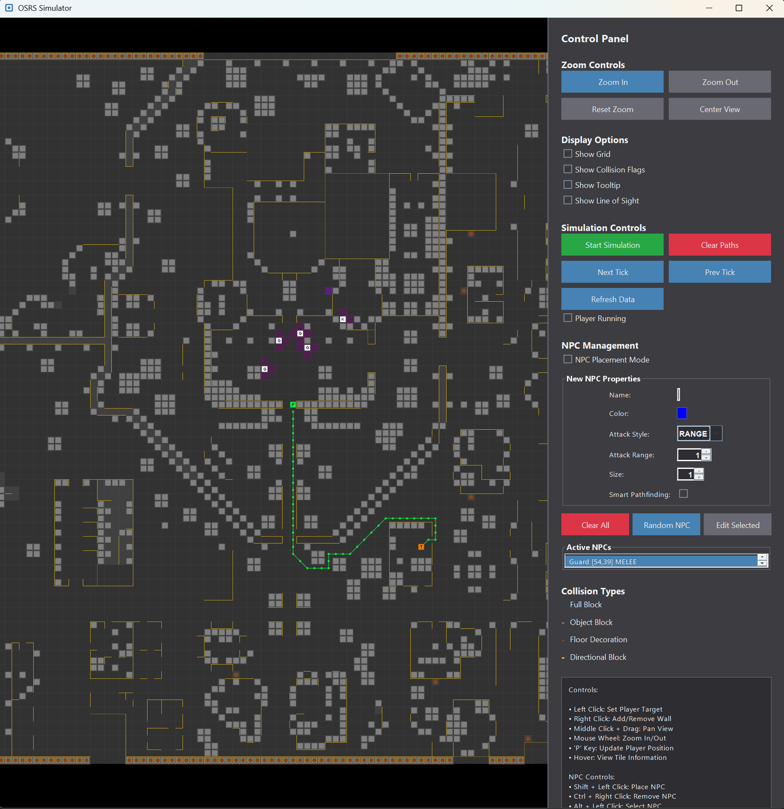

# Simulation Engine

The `sim` package of the API includes classes for simulating game ticks, NPC pathing, movement, line of sight, and players. This is useful for advanced
plugins which evaluate hundreds of potential outcomes every game tick to determine the best "decision". e.g. Inferno and Colosseum plugins.

The simulation engine supports:

- Player and NPC pathing mechanics
- Simulating walking and running movement
- Basic LoS (advanced is still being implemented)
- Placing NPCs at locations
- Different NPC sizes
- Obstacles (based on collision maps)

Currently, there isn't a full-fledged API for performing a simulation in the context of the game; however, 
this is actively being developed and is open to some contributions!

